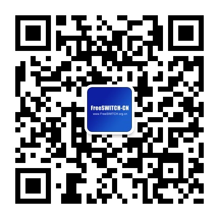
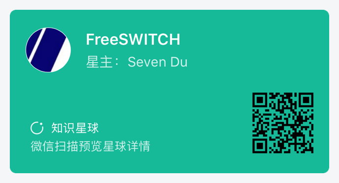
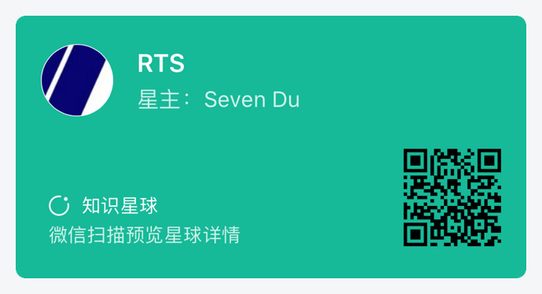

# Awesome FreeSWITCH

A curated list of awesome FreeSWITCH resources, modules, frameworks, libraries and software. Inspired by [awesome-go](https://github.com/avelino/awesome-go).

## Contributing

We support multiple languages, each language on one line. Please make a [Pull Request](https://help.github.com/en/github/collaborating-with-issues-and-pull-requests/about-pull-requests) to keep us Awesome.

We don't have a complete contributing guide yet, maybe take a quick gander at the [contribution guidelines](https://github.com/avelino/awesome-go/blob/master/CONTRIBUTING.md) first. Thanks to all [contributors](https://github.com/rts-cn/awesome-freeswitch/graphs/contributors); you rock!

*If you see a package or project here that is no longer maintained or is not a good fit, please submit a pull request to improve this file. Thank you!*

我们支持多语言，每个语言占一行，欢迎提PR。

## Contents

- [Useful Links](#useful-links)
- [Modules](#modules)
- [Tools](#tools)
- [Resources](#resources)
- [Clients](#clients)
- [Others](#others)

## Useful Links

* https://freeswitch.org - The FreeSWITCH Community.
* https://freeswitch.org - FreeSWITCH社区。
* https://signalwire.com - An elastic communications cloud with advanced APIs for voice, SMS
and video designed by the pioneers of software-defined telecom.
* https://signalwire.com - 用于音频、视频、SMS的高级云计算通信平台，由软件定义电信网先驱们设计。
* http://www.freeswitch.org.cn - FreeSWITCH中文社区。
* https://book.dujinfang.com/ FreeSWITCH相关中文图书。
* http://x-y-t.cn/training.html FreeSWITCH培训课程（中文）。
* https://github.com/rts-cn RTS实时通信解决方案。

## Modules

* https://github.com/rts-cn/mod_shine - 使用shine进行MP3录音的库。
* https://github.com/rts-cn/mod_vnc - 与VNC交互的模块
* https://github.com/rts-cn/mod_x11 - 与X11交互的模块
* https://github.com/rts-cn/mod_aac - AAC编解码模块

## Tools

* https://github.com/rts-cn/freeswitch-tools - FreeSWITCH Tools

## Resources

* https://github.com/rts-cn/zh FreeSWITCH中文语音包
* https://github.com/rts-cn/fsdg-code 《FreeSWITCH权威指南》随书代码。

# Clients

* https://github.com/gmaruzz/saraphone WebRTC SIP Phone

## Others

* Placeholder for other uncategorized awesome projects.

